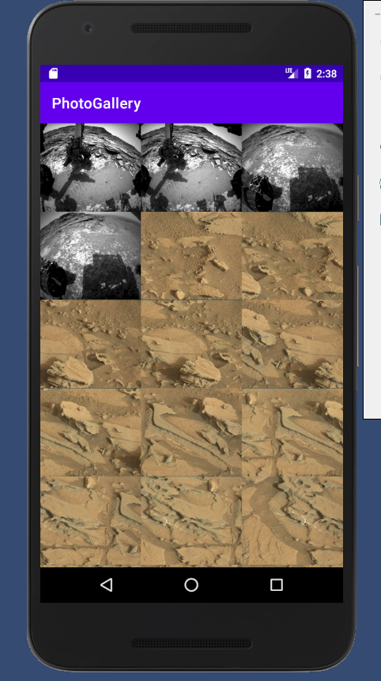

# 火星探测车拍摄照片展示应用实现

---

## 实验目的

1. 掌握持久化技术

2. 掌握 HTTP 和后台任务

3. 掌握 Looper、Handler 与 HandlerThread

## 实验开发环境和工具

- OS：Windows 10

- IDE：Android Studio

- 编程语言：Java

## 实验要求

1. 仿效教材第 25 章例子，开发展示 NASA 的火星探测器所拍摄照片的 APP。

2. 利用**持久化**保存技术对网络下载的图片进行缓存，对已缓存的图片直接从本地读取，减少重复的网络请求。

3. [API 的使用说明](https://api.nasa.gov/)，选择 Mars Rover Photos API。API 参考：

    ```js
    https://api.nasa.gov/mars-photos/api/v1/rovers/curiosity/photos?sol=1000&api_key=DEMO_KEY
    ```

## 实验内容

### 问题描述

一个获取 NASA API 数据，并下载对应图片，最后展示在 APP 中的应用。要求使用持久化技术进行缓存处理。

### 设计简要描述

从上面的描述可知，我们的 APP 和教材第 25 章的例子类似：

- 视图：主 `Activity` 托管一个 `Fragment`，`Fragment` 则使用一个 `RecyclerView` 来展示图片；

- 模型：保存图片元数据的类 `GalleryItem`、处理 API 的类 `NasaFetcher` 和下载图片的类 `ThumbnailDownloader`；

- 控制器：获取 API 的数据保存到后台（使用 `AsyncTask`），然后在后台调用工具类下载图片，通过绑定将图片更新到 `RecyclerView` 上。

由于 APP 架构和教材第 25 章的例子一致，下面的叙述主要针对对该架构的更改。

#### `NasaFetcher` 的实现

对 NASA API 进行请求和处理的对象。

NASA API 的使用很简单，只要使用邮箱注册一个 `api_key` 即可。在 NasaFetcher 中添加字段：

```java
private static final NASA_API_KEY = <api_key>;
```

保存自己的 `api_key`。

`NasaFetcher` 类有以下方法：

```java
/**
 * 请求 urlSpec 指定的资源，并以字节串的形式返回
 *
 * @param urlSpec 资源的 URL
 * @return 资源的字节串表达
 * @throws IOException
 */
public byte[] getUrlBytes(String urlSpec) throws IOException;

/**
 * 请求 urlSpec 指定的资源，并以字符串的形式返回
 *
 * @param urlSpec 资源的 URL
 * @return 资源的字符串表达
 * @throws IOException 访问 API 异常
 */
public String getUrlString(String urlSpec) throws IOException;

/**
 * 请求 API，并返回解析后的数据
 *
 * @return 包含 GalleryItem 的 List
 */
public List<GalleryItem> fetchGalleryItems();

/**
 * 从 jsonBody 中解析信息并以 GalleryItem 对象保存到 itemList 中。
 *
 * @param itemList 保存解析结果，保存的数据类型是 GalleryItem
 * @param jsonBody 保存原始数据的 JSON 对象
 * @throws IOException
 * @throws JSONException
 */
private void parseGalleryItems(List<GalleryItem> itemList, JSONObject jsonBody) throws IOException, JSONException;
```

这些方法跟教材案例的 `FlickFetchr` 类中的方法的功能没有区别。现在对 `fetchGalleryItem` 和 `parseGalleryItems` 进行更改。

首先查看 NASA API 返回结果（JSON 格式）的结构:

```json
{
    "photos": [
        {
            "id": 102693,
            "sol": 1000,
            "camera": {
                "id": 20,
                "name": "FHAZ",
                "rover_id": 5,
                "full_name": "Front Hazard Avoidance Camera"
            },
            "img_src": "http://mars.jpl.nasa.gov/msl-raw-images/proj/msl/redops/ods/surface/sol/01000/opgs/edr/fcam/FLB_486265257EDR_F0481570FHAZ00323M_.JPG",
            "earth_date": "2015-05-30",
            "rover": {
                "id": 5,
                "name": "Curiosity",
                "landing_date": "2012-08-06",
                "launch_date": "2011-11-26",
                "status": "active"
            }
        },
        {
            "id": 102694,
            "sol": 1000,
            "camera": {
                "id": 20,
                "name": "FHAZ",
                "rover_id": 5,
                "full_name": "Front Hazard Avoidance Camera"
            },
            "img_src": "http://mars.jpl.nasa.gov/msl-raw-images/proj/msl/redops/ods/surface/sol/01000/opgs/edr/fcam/FRB_486265257EDR_F0481570FHAZ00323M_.JPG",
            "earth_date": "2015-05-30",
            "rover": {
                "id": 5,
                "name": "Curiosity",
                "landing_date": "2012-08-06",
                "launch_date": "2011-11-26",
                "status": "active"
            }
        },
        // More Objects...
    ]
}
```

可以看出 API 返回的结果是 JSON 对象，其中包含一个键为 `photos` 的 JSON 数组，数组中都是保存每个图像元数据的 JSON 对象。我们主要感兴趣 `img_src` 键值对，它保存图像的 URL。现在根据 API 返回的结果的格式，修改 `parseGalleryItems`：

```java
/**
 * 从 jsonBody 中解析信息并以 GalleryItem 对象保存到 itemList 中。
 *
 * @param itemList 保存解析结果，保存的数据类型是 GalleryItem
 * @param jsonBody 保存原始数据的 JSON 对象
 * @throws IOException
 * @throws JSONException
 */
private void parseGalleryItems(List<GalleryItem> itemList, JSONObject jsonBody) throws IOException, JSONException {
    JSONArray photosJsonArray = jsonBody.getJSONArray("photos");
    for (int i = 0; i < photosJsonArray.length(); i++) {
        JSONObject photoJsonObject = photosJsonArray.getJSONObject(i);

        GalleryItem galleryItem = new GalleryItem();
        galleryItem.setId(photoJsonObject.getInt("id"));
        galleryItem.setImageSource(photoJsonObject.getString("img_src"));
        galleryItem.setEarthDate(photoJsonObject.getString("earth_date"));

        Log.d(TAG, "Parsed photo: " + galleryItem);
        itemList.add(galleryItem);
    }
}
```

根据 API 的请求方法，更改 `fetchGalleryItems`：

```java
/**
 * 请求 API，并返回解析后的数据
 *
 * @return 包含 GalleryItem 的 List
 */
public List<GalleryItem> fetchGalleryItems() {
    List<GalleryItem> galleryItemList = new ArrayList<>();

    try {
        String url = Uri.parse("https://api.nasa.gov/mars-photos/api/v1/rovers/curiosity/photos")
                .buildUpon()
                .appendQueryParameter("sol", "1000")
                .appendQueryParameter("api_key", NASA_API_KEY) // 使用申请到的 api_key
                .build().toString();

        String jsonString = getUrlString(url);
        Log.i(TAG, "Received JSON: " + jsonString);
        // 使用 JSON 的手动解析
        parseGalleryItems(galleryItemList, new JSONObject(jsonString));
    } catch (IOException ioException) {
        Log.e(TAG, "Failed to fetch items", ioException);
    } catch (JSONException jsonException) {
        Log.e(TAG, "Failed to parse JSON", jsonException);
    }

    return galleryItemList;
}
```

#### `GalleryItem` 类的实现

根据 API 返回的结果的格式，我们现在修改 `GalleryItem`：

```java
/**
 * 保存图片的元数据的对象
 */
public class GalleryItem {
    private int mId;
    private int mSol;
    private Camera mCamera = new GalleryItem.Camera();
    private String mImageSource;
    private String mEarthDate;
    private Rover mRover = new GalleryItem.Rover();

    class Camera {
        private int mId;
        private String mName;
        private int mRoverId;
        private String mFullName;

        @Override
        public @NotNull String toString() {/* ... */}

        // getters and setters...
    }

    class Rover {
        private int mId;
        private String mName;
        private String mLandingDate;
        private String mLaunchDate;
        private String mStatus;

        @Override
        public @NotNull String toString() {/* ... */}

        // getters and setters...
    }

    @Override
    public @NotNull String toString() {/* ... */}

    // getters and setters...
}
```

可以看出 `GalleryItem` 类有很多字段，如果以后还要提取除了 `img_src` 以外的数据，那 `parseGalleryItems` 就会被重复修改。

为了解决这个问题可以使用 Google 开发的库——`Gson`。

在 `build.gradle` 中添加依赖：

```gradle
dependencies {
    implementation 'com.google.code.gson:gson:2.8.6'
}
```

`Gson` 库的方便之处在于它可以根据对象的字段，自动的在 JSON 字符串和对象之间转换，但是 `Gson` 要求字段名和键的名字一致，这会破坏驼峰命名法（`img_src` v.s. `mImageSource`），同时 `Gson` 要求字段可达性不能为 `private` 这又破坏了信息隐藏的要求。为了解决这个问题，在 `GalleryItem.java` 中新建一个 `GalleryItemGsonHelper` 类：

```java
/**
 * 对使用 Gson 解析 GalleryItem 提供帮助的类
 */
class GalleryItemGsonHelper {
    int id;
    int sol;
    CameraGsonHelper camera = new GalleryItemGsonHelper.CameraGsonHelper();
    String img_src;
    String earth_date;
    RoverGsonHelper rover = new GalleryItemGsonHelper.RoverGsonHelper();

    class CameraGsonHelper {
        int id;
        String name;
        int rover_id;
        String full_name;
    }

    class RoverGsonHelper {
        int id;
        String name;
        String landing_date;
        String launch_date;
        String status;
    }
}
```

添加 `generateGalleryItem` 方法将 `GalleryItemGsonHelper` 类转换成 `GalleryItem` 类：

```java
// 这代码着实有点累赘
/**
 * 将 GalleryItemGsonHelper 对象转换为 GalleryItem 对象
 *
 * @return GalleryItem 对象
 */
private GalleryItem generateGalleryItem() {
    GalleryItem galleryItem = new GalleryItem();
    galleryItem.setId(id);
    galleryItem.setSol(sol);
    galleryItem.getCamera().setId(camera.id);
    galleryItem.getCamera().setName(camera.name);
    galleryItem.getCamera().setRoverId(camera.rover_id);
    galleryItem.getCamera().setFullName(camera.full_name);
    galleryItem.setImageSource(img_src);
    galleryItem.setEarthDate(earth_date);
    galleryItem.getRover().setId(rover.id);
    galleryItem.getRover().setName(rover.name);
    galleryItem.getRover().setLandingDate(rover.landing_date);
    galleryItem.getRover().setLaunchDate(rover.launch_date);
    galleryItem.getRover().setStatus(rover.status);
    return galleryItem;
}
```

最后考虑到 `Gson` 是针对对象的，我们让 `GalleryItemGsonHelper` 类提供从 JSON 字符串中提取 `GalleryItem` 的方法：

```java
/**
 * 从 jsonObject 中提取 GalleryItem 对象并返回
 * @param jsonObject GalleryItem 的 JSON 表示的 JSONObject 对象
 * @return GalleryItem 对象
 */
public static GalleryItem toGalleryItem(JSONObject jsonObject) {
    Gson gson = new Gson();
    GalleryItemGsonHelper helper = gson.fromJson(String.valueOf(jsonObject), GalleryItemGsonHelper.class);
    return helper.generateGalleryItem();
}

/**
 * 从 jsonArray 中提取 GalleryItem 对象并存入 List<GalleryItem> 中，最后返回 List。
 * @param jsonArray 保存一系列 GalleryItem 的 JSON 表示的 JSONArray 对象
 * @return 保存一系列 GalleryItem 对象的 List
 */
public static List<GalleryItem> toGalleryItemList(JSONArray jsonArray) {
    Gson gson = new Gson();
    GalleryItemGsonHelper[] helpers = gson.fromJson(String.valueOf(jsonArray), GalleryItemGsonHelper[].class);

    List<GalleryItem> galleryItemList = new ArrayList<>();
    for (GalleryItemGsonHelper helper : helpers) {
        galleryItemList.add(helper.generateGalleryItem());
    }

    return galleryItemList;
}
```

使用 `GalleryItemGsonHelper.toGalleryItemList()` 重构 `NasaFetcher.fetchGalleryItems`。

```java
/**
 * 请求 API，并返回解析后的数据
 *
 * @return 包含 GalleryItem 的 List
 */
public List<GalleryItem> fetchGalleryItems() {
    List<GalleryItem> galleryItemList = new ArrayList<>();

    try {
        // ...
        String jsonString = getUrlString(url);

        // parseGalleryItems(galleryItemList, new JSONObject(jsonString));

        //  使用 Gson 的自动解析
        galleryItemList = GalleryItemGsonHelper.toGalleryItemList(new JSONObject(jsonString).getJSONArray("photos"));
    } catch (/*...*/) {
        // ...
    }

    return galleryItemList;
}
```

#### `ThumbnailDownloader<T>` 类的实现

`ThumbnailDownload<T>` 类的方法众多，它的功能复杂：持有 UI 线程和后台线程间的 `Handler`，实现一个双向通道的工具类，UI 线程可以通过实现 `onThumbnailDownloadListener` 的接口，定义对下载好的图片的处理，而`ThumbnailDownload<T>` 类自己接受 UI 线程的请求并启动后台的下载功能。虽然功能复杂，但要实现缓存的功能，只要在下载图片的方法做处理即可，即 `handlerRequest` 函数：

```java
/**
 * 在后台进行请求处理
 *
 * @param target
 */
private void handleRequest(final T target) {

    final String url = mRequestMap.get(target);
    if (url == null) {
        return;
    }

    try {
        byte[] bitmapBytes = new NasaFetcher().getUrlBytes(url);
        final Bitmap bitmap = BitmapFactory.decodeByteArray(bitmapBytes, 0,  bitmapBytes.length);
        Log.i(TAG, "Bitmap created");

    } catch (IOException ioException) {
        Log.e(TAG, "Error downloading image", ioException);
        final Bitmap bitmap = null;
    }

    mResponseHandler.post(new Runnable() {
        @Override
        public void run() {
            if (mRequestMap.get(target) != url || mHasQuit) {
                return;
            }

            mRequestMap.remove(target);
            mThumbnailDownloadListener.onThumbnailDownloaded(target, bitmap);
        }
    });
}
```

可以看出，`handleRequest` 在接到请求后首先解析出对应的图片的 URL，之后尝试下载，最后将下载好的 `Bitmap` 通过 `Handler` 会送到 UI 线程处理。

首先使用 Android 提供的 `LruCache` 类进行处理。`LruCache` 提供基于 LRU（当缓存池满时清除最近使用次数最少的缓存）策略的缓存类。`LruCache` 是泛型类，类似 `Map` 接受两个类型参数，程序员可以通过键存入和取出对应的值（即要缓存的值），`LruCache` 的构造函数接受一个整型值表示缓存的大小。首先在 `ThumbnailDownloader<T>` 创建两个字段 `mMemoryCacheSize` 和 `mBitmapLruCache`。

```java
private static final int mMemoryCacheSize = 512 * 1024 * 1024;
private final LruCache<String, Bitmap> mBitmapLruCache = new LruCache<String, Bitmap>(mMemoryCacheSize);
```

`LruCache` 接受的缓存大小并没有语义，我们要实现 `sizeOf` 方法，它向 `LruCache` 报告一个被缓存的值的大小：

```java
@Override
protected int sizeOf(String key, Bitmap value) {
      return value.getByteCount();
}
```

由于这里我们返回的是 `Bitmap` 的字节数，所以 `mMemoryCacheSize` 的单位也是字节。

我们现在可以直接使用 `mBitmapLruCache` 了，在下载图片前先查看图片是否在缓存中，在的话就不用下载，直接返回 `Bitmap`，不在就先下载，然后存入缓存，最后返回 `Bitmap`。但是，`LruCache` 提供了更方便的使用方式，那就是实现 `create` 方法。在实现 `create` 方法后，对于不在缓存池内的缓存，`LruCache` 就会调用 `create` 方法生成对应的值，再存入缓存，最后返回。

```java
/**
 * 该函数在缓存不存在时被调用，创建需求的对象并缓存，最后返回给 get()
 *
 * @param url URL
 * @return Bitmap 对象
 */
@Override
protected Bitmap create(String url) {
    try {
        byte[] bitmapBytes = new NasaFetcher().getUrlBytes(url);
        final Bitmap bitmap = BitmapFactory.decodeByteArray(bitmapBytes,
                0,
                bitmapBytes.length);
        Log.i(TAG, "Bitmap created");
        return bitmap;
    } catch (IOException ioException) {
        Log.e(TAG, "Error downloading image", ioException);
    }
    return null;
}
```

现在，重构 `handleRequest` 方法：

```java
/**
 * 在后台进行请求处理
 *
 * @param target
 */
private void handleRequest(final T target) {

    final String url = mRequestMap.get(target);
    if (url == null) {
        return;
    }

    // 使用内存 LRU 缓存
    final Bitmap bitmap = mBitmapLruCache.get(url);

    mResponseHandler.post(new Runnable() {
        // ...
    });
}
```

然而，实验要求的是持久化技术的缓存，`LruCache` 实现的是基于内存的缓存，不符合要求。不过我们可以模仿 `LruCache` 的实现，定义一个内部类 `BitmapDiskCache`。

我们采取文件本地保存的方式进行持久化缓存，先查看是否保存在本地，没有的话，就先下载，然后保存到本地，最后返回结果。根据刚才的分析，我们需要 `saveBitmap` 和 `loadBitmap` 方法。但是，我们先要解决如何给每个图片 URL 生成唯一的标识符的问题，因为我们是持久化缓存，要做到在重启应用之后都可以使用缓存，我们不能在 Runtime 给每个 URL 分配一次性的标识符（比如简单的从 0 递增），而是要对 URL 分配唯一的标识符。`UUID` 和 `Object.hashCode` 还有 `MessageDigest` 都可以解决问题，但我们还有更方便的方法，URL 自己就是唯一的标识符，我们提取 URL 中的文件名即可：

```java
/**
 * 为 url 生成唯一的识别符
 *
 * @param url URL
 * @return 唯一的识别符
 */
public String generateFilename(String url) {
    if (url.endsWith("/")) {
        url = url.substring(0, url.length() - 1);
    }
    String[] strings = url.split("/");
    return strings[strings.length - 1];
}
```

现在我们实现 `saveBitmap` 和 `loadBitmap` 的方法：

```java
/**
 * 将 Bitmap 对象保存到本地
 *
 * @param bitmap   Bitmap 对象
 * @param filename 文件名
 */
public void saveBitmap(Bitmap bitmap, String filename) {
    FileOutputStream out;
    try {
        out = openFileOutput(filename, Context.MODE_PRIVATE);
        bitmap.compress(Bitmap.CompressFormat.PNG, 100, out);
        out.flush();
        out.close();
    } catch (IOException e) {
        Log.e(TAG, "Failed to save file to: " + filename);
    }
}

/**
 * 通过 filename 从本地载入 Bitmap
 *
 * @param filename 图片文件名
 * @return Bitmap 对象
 */
public Bitmap loadBitmap(String filename) {
    FileInputStream in;
    try {
        in = openFileInput(filename);
        return BitmapFactory.decodeStream(in);
    } catch (FileNotFoundException e) {
        Log.e(TAG, "Failed to load file from: " + filename);
    }
    return null;
}
```

`openFileOutput` 和 `openFileInput` 打开的是所谓 internal storage，是 APP 自己拥有的外存空间，可以不用权限申请就可以访问，缺点是不允许路径名。

> 注意：虽然我们使用 PNG 格式保存 Bitmap，而图片文件名（URL 中的文件名）是 JPG 格式，但 Bitmap 类很「聪明」，会通过图片编码判断格式，而不是轻信后缀名。

现在，添加 `get` 方法。和 `LruCache` 一样，隐藏缓存的细节：

```java
/**
 * 模仿 LruCache 尝试读取缓存，如果不存在就下载并缓存，再返回结果
 *
 * @param url 图片的 URL
 * @return Bitmap 对象
 */
public Bitmap get(String url) {
    Bitmap bitmap;
    String filename = generateFilename(url);
    // 如果缓存不存在
    if ((bitmap = loadBitmap(filename)) == null) {
        // 下载图片
        try {
            byte[] bitmapBytes = new NasaFetcher().getUrlBytes(url);
            bitmap = BitmapFactory.decodeByteArray(bitmapBytes,
                    0,
                    bitmapBytes.length);
            Log.i(TAG, "Bitmap created");

            // 缓存图片
            saveBitmap(bitmap, filename);
            return bitmap;
        } catch (IOException ioException) {
            Log.e(TAG, "Error downloading image", ioException);
            return null;
        }
    }

    // 如果缓存存在，直接返回
    Log.i(TAG, "Use Disk Cache");
    return bitmap;
}
```

最后修改 `handleRequest` 方法：

```java
private void handleRequest(final T target) {

    final String url = mRequestMap.get(target);
    if (url == null) {
        return;
    }

    // 使用内存 LRU 缓存
    // final Bitmap bitmap = mBitmapLruCache.get(url);

    // 使用外存缓存
    final Bitmap bitmap = mBitmapDiskCache.get(url);

    mResponseHandler.post(new Runnable() {
        // ...
    });
}
```

就像很多应用一样，我们可以提供一个清理缓存的操作。事实上，由于 internal storage 用户访问不到，我们必须提供一个选项供用户使用。这里只给出功能实现：

```java
/**
 * 清除外存缓存
 */
private void clearInternalStorageCache() {
    File localDir = getActivity().getFilesDir();
    File[] files = localDir.listFiles();
    for (File file : files) {
        String[] strings = file.getName().split("\\.");
        String fileExtension = strings[strings.length - 1];
        if (fileExtension.matches("jpg|JPG|png|PNG|gif|GIF")) {
            Log.d(TAG, "List File to be delete: " + file.getName());
            file.delete();
        }
    }
}
```

### 程序清单

- `GalleryItem.java`
  - `GalleryItem`：保存图片元数据的类
  - `GalleryItemGsonHelper`：提供从 JSON 转换到 GalleryItem 的静态方法

- `NasaFetcher.java`：提供基本的网络资源获取和对 API 调用并解析结果的方法

- `PhotoGalleryActivity.java`：托管 Fragment 的 Activity

- `PhotoGalleryFragment.java`：控制器，控制界面的更新和数据的访问

- `SingleFragmentActivity.java`：`PhotoGalleryActivity.java` 的父类

- `ThumbnailDownloader`：提供对图片的下载和缓存，还有 UI 线程和后台线程间的信息交互

- `bill_up_close.png`：占位图片

- `activity_fragment.xml`：`PhotoGalleryActivity.java` 的 Layout 文件

- `fragment_photo_gallery.xml`：`PhotoGalleryFragment.java` 的 Layout 文件

- `list_item_gallery.xml`：`RecyclerView.PlaceHolder` 的 Layout 文件

### 调试报告

#### 地址重定向

运行程序，却发现全是 Bill 的大脸，图片却没有下载下来。打开图片的 URL，图片正常显示。想到源代码的异常处理部分：

```java
int httpCode = connection.getResponseCode();
if (httpCode != HttpURLConnection.HTTP_OK) {
    // ...
}
```

在 Log 中输出 `httpCode` 发现代码是 301 Moved Permanently。资源被移走了，不过好在 HTTP 服务器返回了新的地址。

```js
HTTP/1.1 301 Moved Permanently
Location: https://www.example.org/index.asp
```

`Location` 保存了新的地址。现在修改代码，解决重定向问题：

```java
if (httpCode != HttpURLConnection.HTTP_OK) {
    // 处理重定向问题
    if (httpCode > 300 && httpCode < 400) {
        String redirectHeader = connection.getHeaderField("Location");

        if (TextUtils.isEmpty(redirectHeader))
            throw new IOException("Failed to redirect, there no useful redirect location");

        // 危险的递归，但是很方便不是吗？
        return getUrlBytes(redirectHeader);
    }
    else {
        // 生成 IOException
        Log.e(TAG, "Cannot handler HTTP Code: " + connection.getResponseCode());
        throw new IOException(connection.getResponseMessage() + ": with " + urlSpec);
    }
}
```

> 注意：为了性能和安全考虑，可以将递归改为迭代，并限制重定向的次数。

#### `openFileOutput` 不存在

运行程序，抛出异常，表示 `openFileOutput` 不存在。原因是：`openFileOutput` 和 `openFileInput` 是在 APP 自己的外存空间（`/data/data/<app-name>/`）中存储和读取的，而 `ThumbnailDownloader` 类不持有 `Context`，无法知道对应的地址。
`ThumbnailDownloader` 没有，但是 `PhotoGalleryFragment` 有 `Context`，在 `BitmapDiskCache` 中添加字段和构造函数：

```java
class BitmapDiskCache {
    private final Context mContext;

    BitmapDiskCache(Context context) {
        mContext = context;
    }
}
```

再更新 `ThumbnailDownloader<T>` 的构造函数：

```java
public ThumbnailDownloader(Handler responseHandler, Context context) {
    super(TAG);
    mResponseHandler = responseHandler;
    mBitmapDiskCache = new BitmapDiskCache(context);
}
```

同样修改 `PhotoGalleryFragment` 中的代码：

```java
// mThumbnailDownloader = new ThumbnailDownloader<>(responseHandler);
mThumbnailDownloader = new ThumbnailDownloader<>(responseHandler, getActivity());
```

最后更新 `saveBitmap` 和 `loadBitmap`：

```java
/**
 * 将 Bitmap 对象保存到本地
 *
 * @param bitmap   Bitmap 对象
 * @param filename 文件名
 */
public void saveBitmap(Bitmap bitmap, String filename) {
    FileOutputStream out;
    try {
        out = mContext.openFileOutput(filename, Context.MODE_PRIVATE);
        bitmap.compress(Bitmap.CompressFormat.PNG, 100, out);
        out.flush();
        out.close();
    } catch (IOException e) {
        Log.e(TAG, "Failed to save file to: " + filename);
    }
}

/**
 * 通过 filename 从本地载入 Bitmap
 *
 * @param filename 图片文件名
 * @return Bitmap 对象
 */
public Bitmap loadBitmap(String filename) {
    FileInputStream in;
    try {
        in = mContext.openFileInput(filename);
        return BitmapFactory.decodeStream(in);
    } catch (FileNotFoundException e) {
        Log.e(TAG, "Failed to load file from: " + filename);
    }
    return null;
}
```

代码编译成功。

### 结果分析

